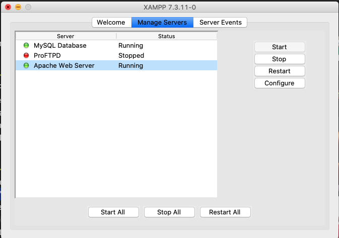
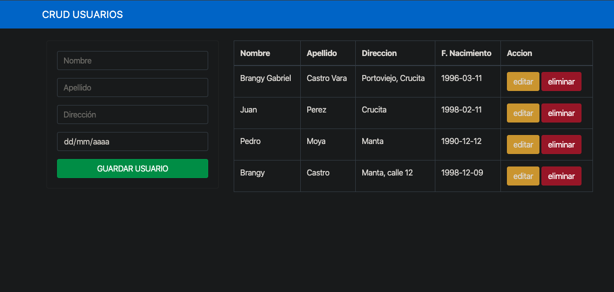

# CRUD con PHP y MySQL

## Importante

Para ejecutar local debe tener lo siguiente:

- Servidor web local (de preferencia **XAMPP**) 
- Editor de texto (**Visual Studio Code**)
- Navegador (**Chrome**)

## ¿Como ejecutar?

- Clonar o descargar este repositorio
- Ubicar la carpeta Clonada en la siguiente dirección:

 Para Mac

        /Applications/XAMPP/htdocs/

Para Windows

        C:\xampp\htdocs/

- Una vez ubicada la carpeta se procede a levantar los servicios de base de datos y servidor.

- Ahora se procede a crear la base de datos, nos dirigimos a nuestro navegador y copiamos la siguiente URL.

        http://localhost/phpmyadmin/index.php

- En la carpeta **DATABASE** se encuentra un script se copia y se ejecuta, esto creara la base de datos con nombre **web-usuario** y la tabla **usuarios**.

- Una vez creada la base de datos, procedemos a irnos a la siguiente URL.

        http://localhost/web-usuarios/index.php

Ojo que **WEB-USUARIOS** es el nombre que le di a la carpeta donde está almacenado todo el proyecto.

Y listo puedes disfrutar de un **CRUD** con **PHP** y **MySQL**.